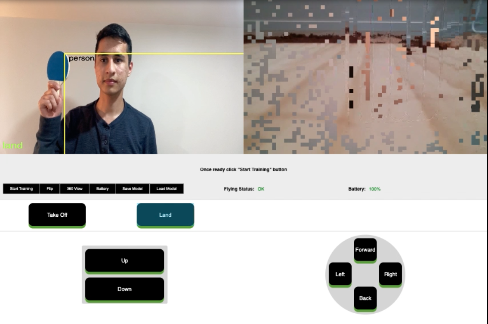

# Tello Project

This is an interactive interface that sends different commands (e.g move forward, take off, land) a drone based on different poses and gestures. It uses ML5 libary to train a model and then use that model to predict a certain input, in this case video from your webcam.

# Demo

## [Live Demo](https://www.youtube.com/watch?v=33dVx6BNDlk)

&nbsp;
&nbsp;
&nbsp;

## Instructions

To be able to run this project you'll need to follow the following steps

- Make sure you have a tello drone
- Clone this repo on your computer
- Install ffmpeg on your system (if you're on MacOS you can do it by typing `brew install ffmpeg` in the terminal)
- Install the dependencies using `npm i`
- Load the dashboard by going to `localhost:3000`
- Train the model
- Connect the drone to your computer using the WIFI
- Restart the server using `npm run dev`

&nbsp;
&nbsp;
&nbsp;

## Precautions

To keep yourself and everyone else safe, it is important that you try this app indoor with enough space to prevent causing injuries or damaging the drone.

&nbsp;
&nbsp;
&nbsp;

## Reusing the trained model

If you want to save a model that you have trained in this app, you can click on the `save model` button and it will be downloaded to the default download folder of your computer. Then you can drog and drop the two files `model.json, model.weights.bin` into the `/server/public` folder of this project. Next time when you run the app you can click on `load model` to use your saved model.
